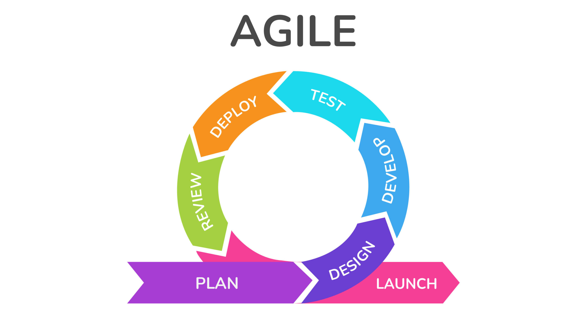

# **Tugas KPPL Week 6**

**Nama**: Adyuta Prajahita Murdianto

**NRP**: 5025221186

**Kelas**: KPPL E

Buatlah Prototipe Solusi Technical Support System dengan pendekatan Waterfall atau Agile Develepment

## **Agile**

`Agile` adalah pendekatan pengembangan perangkat lunak yang bersifat `iteratif` dan `inkremental`. Proyek ini akan dibagi ke dalam beberapa siklus pengembangan yang disebut `sprint`. Setiap sprint memiliki durasi tertentu (biasanya 2–4 minggu), dan pada akhir sprint, tim harus menghasilkan fitur yang siap diuji dan, jika memungkinkan, diimplementasikan ke dalam sistem.

## **Sprint**

`Sprint` adalah salah satu konsep utama dalam metode `Agile` yang merujuk pada periode waktu yang terstruktur di mana tim pengembang bekerja untuk menyelesaikan tugas-tugas atau fitur yang telah direncanakan sebelumnya dari backlog produk. Sprint biasanya berlangsung selama 1 hingga 4 minggu, tergantung pada ukuran dan kompleksitas proyek, serta ritme kerja tim.
Berikut sprint-sprint yang bisa dilakukan dalam mengembangkan sistem `tech support`,

### **Sprint 1: Pengelolaan Tiket (Ticket Management)**

`Durasi`: 2 minggu

**Tujuan Sprint**

Mengembangkan sistem pengelolaan tiket di mana pengguna dapat mengajukan tiket masalah, agen teknis dapat menerima dan memproses tiket, serta pengguna dapat melacak status tiket mereka.

**User Stories**

- Sebagai pengguna, saya ingin dapat membuat tiket baru yang mencakup informasi tentang masalah teknis yang saya hadapi.

- Sebagai pengguna, saya ingin melihat status tiket yang saya ajukan (baru, sedang dikerjakan, selesai).

- Sebagai agen teknis, saya ingin menerima tiket dari pengguna dan menugaskannya ke tim yang sesuai.

**Tugas Sprint**

- Membuat form input tiket (informasi masalah, kategori, prioritas).

- Sistem backend untuk mencatat dan menyimpan tiket.

- Tampilan daftar tiket di dashboard pengguna dan agen.

- Fitur untuk agen teknis dalam memproses tiket dan memperbarui status.

**Hasil Sprint**

Sistem dasar pengelolaan tiket dengan kemampuan untuk mengajukan, memproses, dan memantau status tiket.

### **Sprint 2: Sistem Live Chat (Live Chat System)**

`Durasi`: 2 minggu

**Tujuan Sprint**

Menambahkan fitur live chat yang memungkinkan pengguna berkomunikasi langsung dengan agen dukungan teknis untuk masalah yang lebih mendesak atau membutuhkan bantuan langsung.

**User Stories**

- Sebagai pengguna, saya ingin dapat mengakses live chat untuk berbicara langsung dengan agen teknis.

- Sebagai agen, saya ingin menerima notifikasi setiap kali ada pengguna yang memulai sesi live chat.

**Tugas Sprint**

- Integrasi layanan chat ke dalam sistem.

- Mengembangkan interface chat untuk pengguna dan agen.

- Pengembangan fitur notifikasi agen ketika ada chat baru.

- Membuat log percakapan untuk riwayat chat.

**Hasil Sprint**

Sistem live chat yang memungkinkan komunikasi langsung antara pengguna dan agen, dengan log percakapan yang disimpan.

### **Sprint 3: Basis Pengetahuan dan FAQ (Knowledge Base and FAQ)**

`Durasi`: 2 minggu

**Tujuan Sprint**

Membuat basis pengetahuan (knowledge base) yang memungkinkan pengguna mencari solusi secara mandiri sebelum mengajukan tiket atau memulai chat.

**User Stories**

- Sebagai pengguna, saya ingin mencari solusi di FAQ atau basis pengetahuan untuk memecahkan masalah saya secara mandiri.

- Sebagai administrator, saya ingin mengelola dan memperbarui artikel di basis pengetahuan.

**Tugas Sprint**

- Membuat halaman basis pengetahuan dengan fungsi pencarian.

- Menambahkan modul untuk admin dalam menambahkan atau mengedit artikel FAQ.

- Sistem untuk mengaitkan artikel basis pengetahuan dengan jenis masalah tertentu.

**Hasil Sprint**

Basis pengetahuan yang dapat diakses oleh pengguna dengan fitur pencarian untuk menemukan solusi mandiri.

### **Sprint 4: Sistem Notifikasi dan Pemberitahuan (Notification System)**

`Durasi`: 1 minggu

**Tujuan Sprint**

Mengembangkan sistem notifikasi untuk memberi tahu pengguna tentang pembaruan status tiket mereka atau respons dari agen teknis.

**User Stories**

- Sebagai pengguna, saya ingin menerima notifikasi melalui email atau pesan di dashboard setiap kali ada pembaruan status pada tiket saya.

- Sebagai agen, saya ingin mendapatkan notifikasi ketika ada tiket baru yang masuk.

**Tugas Sprint**

- Pengembangan backend untuk mengirimkan notifikasi berdasarkan perubahan status tiket.

- Integrasi email dan notifikasi di dashboard.

**Hasil Sprint**

Sistem notifikasi yang terintegrasi dengan pengelolaan tiket, mengirimkan pemberitahuan kepada pengguna dan agen sesuai dengan status tiket.

### **Sprint 5: Pengujian Pengguna dan Integrasi (User Testing and Integration)**

`Durasi`: 2 minggu

**Tujuan Sprint**

Melakukan pengujian pada seluruh sistem secara menyeluruh dan mengintegrasikan semua modul yang telah dikembangkan. Mendapatkan umpan balik dari pengguna untuk memperbaiki bug atau menambahkan fitur kecil yang diperlukan.

**User Stories**

- Sebagai pengguna, saya ingin memastikan seluruh sistem (tiket, chat, notifikasi, FAQ) berjalan dengan lancar.

- Sebagai administrator, saya ingin memastikan integrasi antara modul berjalan dengan baik tanpa masalah.

**Tugas Sprint**

- Pengujian end-to-end seluruh sistem.

- Perbaikan bug berdasarkan hasil pengujian.

- Uji coba skenario dengan pengguna untuk mendapatkan umpan balik.

- Implementasi Continuous Integration untuk deployment yang mulus.

**Hasil Sprint**

Sistem siap digunakan secara penuh, setelah perbaikan dari hasil pengujian pengguna dan integrasi modul.

### **Sprint 6: Peluncuran Sistem dan Pemeliharaan (Launch and Maintenance)**

`Durasi`: 2 minggu

**Tujuan Sprint**

Melakukan peluncuran sistem secara resmi dan mempersiapkan untuk tahap pemeliharaan serta penyempurnaan fitur.

**User Stories**

- Sebagai pengguna, saya ingin sistem tersedia secara live sehingga saya bisa menggunakan seluruh fungsionalitasnya.

- Sebagai pengembang, saya ingin melakukan pemeliharaan sistem jika ditemukan bug atau masalah operasional setelah peluncuran.

**Tugas Sprint**

- Peluncuran sistem ke lingkungan produksi.
 
- Pengaturan dukungan teknis untuk pemeliharaan pasca-peluncuran.

- Monitoring performa dan sistem pemantauan log.

**Hasil Sprint**

Sistem diluncurkan dengan pemeliharaan dan perbaikan yang dilakukan secara berkala untuk menjamin stabilitas sistem.
